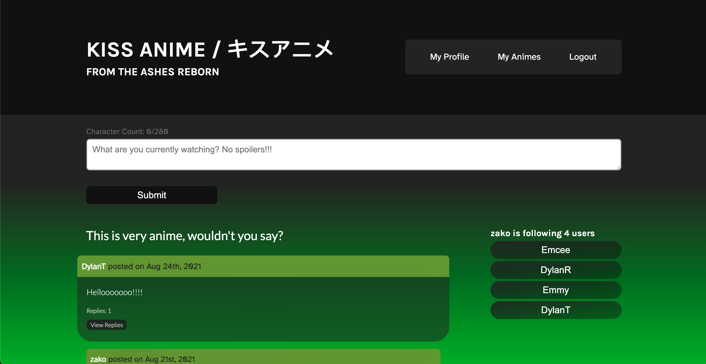

# Kiss Anime 
A Full Stack MERN Application 

## Links

Repo Link: https://github.com/theoneandonlyzako/kiss-anime/ 
Deployed Link: https://my-kiss-anime.herokuapp.com/  

## License
This project is licensed under the Unlicense license.
  

## Table of Contents 
* [Usage](#usage)
* [Technologies](#technologies)
* [Installation](#installation)
* [Contributing](#contributing)
* [Contact](#contact)
* [Site Example](#example)
  

## Usage
A Full Stack MERN Application that gives users a list for searching and saving their favorite anime show, selecting the current episode they are on, make comments about the show and offers follow capabilities so that you can follow other users and comment on their thoughts.
  

## Technologies

- see package.json for more dependencies*
  

## Installation
​**Full app**
1. Install npm packages with `npm i`
2. Start the app with `npm start`. The app should open a browser window at `https://localhost:3001 

**Server only**
1. Navigate to the server directory with `cd server`
2. Install npm packages with `npm i`
3. Start the server with `npm run watch`
4. Navigate to `https://localhost:3001/graphql` to test queries and mutations
  

## Contributing
​Contributors: 
[Ben Gerner](https://github.com/bgerner)
[Dylan Rotich](https://github.com/RotichD)
[Dylan Trecker](https://github.com/d-trecker)
[Michael Chambers](https://github.com/thisEmcee)
and [Zak Stamps](https://github.com/theoneandonlyzako)
With Lots of help from our trusty 'ol friend [Google](https://www.google.com/).
  

## Contact
If you have any questions about the repo, open an issue or contact me directly at theoneandonlyzako@gmail.com or visit my website at zakstamps.com
  

## Example

  

